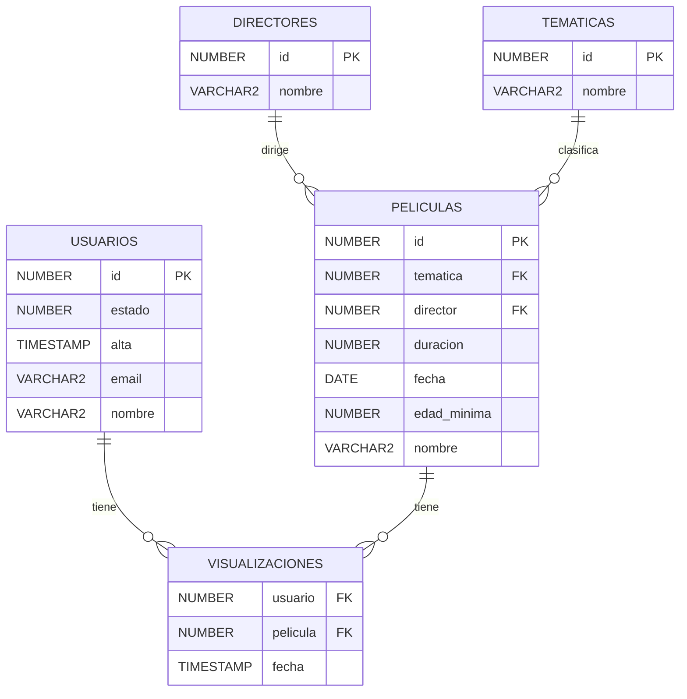

# Federico

Es EL FORMATO que hoy en día se usa para documentar.
Es muy cómodo.. con unos simbolitos vamos dando formato.

Y la gracia es que el documento se ve bien tanto en texto planto, como al convertirlo a HTML, PDF...

Con los #, lo que ponemos son títulos.

## Esto sería un subtítulo

### Y este un subsubtítulo 

Y así podemos poner **hasta 7** (esto sería negrita).
Y para poner algo en cursiva *así*.

Si quiero poner una lista:
- Elemento 1
- Elemento 2
- Elemento 3

Si quiero poner una lista numerada:
1. Elemento 1
1. Elemento 2
1. Elemento 3

Puedo poner tablas:

| Nombre              | Edad | Alta       |
|---------------------|------|------------|
| Juan Pérez          | 30   | 2023-01-01 |
| María García        | 25   | 2023-02-15 |
| Pedro Fernández     | 40   | 2023-03-10 |

```sql
CREATE TABLE usuarios (
    id INT PRIMARY KEY,
    nombre VARCHAR(100),
    edad INT,
    fecha_alta DATE
);

SELECT * FROM usuarios WHERE edad > 30;
```

```cobol

IDENTIFICATION DIVISION.
PROGRAM-ID ADCDAP13.
*
ENVIRONMENT DIVISION.
INPUT-OUTPUT SECTION.
FILE-CONTROL.
    SELECT CON-DATOS    ASSIGN TO PERSONA
            FILE STATUS IS FS-CON-DATOS.
*
    SELECT COPIA        ASSIGN TO COPIA
            FILE STATUS IS FS-COPIA.
*
DATA DIVISION.
FILE SECTION.
FD CON-DATOS
    RECORDING MODE IS F.
01 REG-CON-DATOS          PIC X(10).
*
FD COPIA
    RECORDING MODE IS F.
01 REG-COPIA              PIC X(10).
*
WORKING-STORAGE SECTION.
******************************************************************
*                     V A R I A B L E S                          *
******************************************************************
01 FS-CON-DATOS           PIC 99.
01 
FS-COPIA               PIC 99.

```

